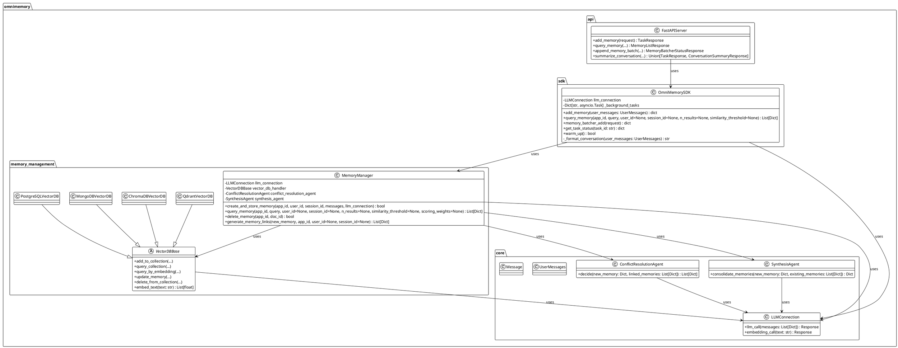
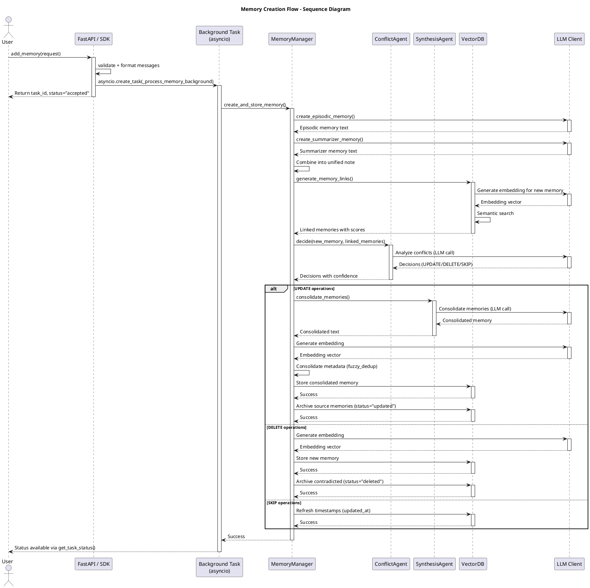
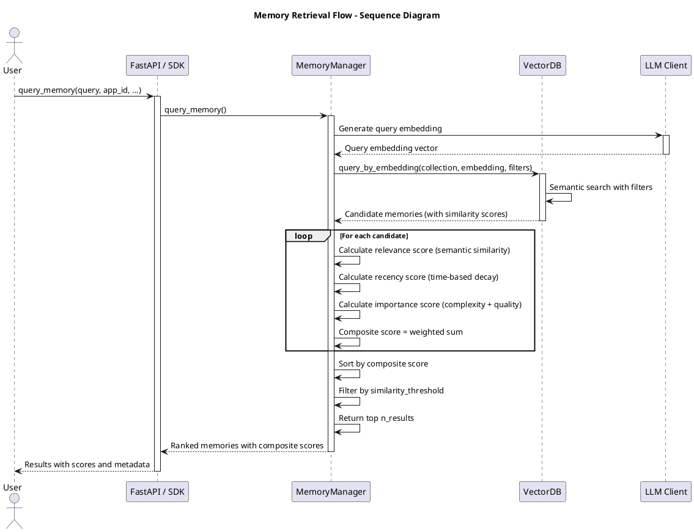

# OmniMemory C4 Architecture Documentation

> **Complete C4 Model Architecture** - System Context, Container, Component, and Code level diagrams for OmniMemory v0

---

## 📐 C4 Model Overview

The C4 model provides four levels of abstraction:
1. **Level 1: System Context** - Shows the system and its users
2. **Level 2: Container** - Shows the high-level technical building blocks
3. **Level 3: Component** - Shows the components within a container
4. **Level 4: Code** - Shows classes, functions, and implementation details

---

## 🎯 Level 1: System Context

**Purpose**: Shows OmniMemory in the context of its users and external systems.

### Diagram

```plantuml
@startuml C4_Context
!include https://raw.githubusercontent.com/plantuml-stdlib/C4-PlantUML/master/C4_Context.puml

LAYOUT_WITH_LEGEND()

title System Context Diagram - OmniMemory

Person(user, "AI Application Developer", "Builds AI applications that need persistent memory capabilities")
Person(agent, "AI Agent", "Uses memory to maintain context and learn from interactions")

System(omnimemory, "OmniMemory", "Self-evolving memory subsystem with FastAPI interface, async processing, and semantic storage")

System_Ext(llm_provider, "LLM / Embedding Provider", "OpenAI, Anthropic, Mistral, etc.\nProvides LLM + embedding services")
System_Ext(vectorstore, "Vector Store", "Qdrant (default) / ChromaDB / MongoDB Atlas / PostgreSQL + pgvector")

Rel(user, omnimemory, "Uses SDK / REST API to add & query memories", "HTTPS / Python SDK")
Rel(agent, omnimemory, "Queries memory context", "HTTPS / SDK")
Rel(omnimemory, llm_provider, "Dual-agent synthesis, conflict resolution, embeddings", "HTTPS/REST API")
Rel(omnimemory, vectorstore, "Stores embeddings + metadata, performs similarity search", "gRPC/HTTP")

@enduml
```

### Description

**Actors:**
- **AI Application Developer**: Integrates OmniMemory SDK into their applications to enable persistent memory
- **AI Agent**: Uses memory to maintain context across conversations and learn from past interactions

**External Systems:**
- **LLM / Embedding Provider**: Handles episodic & summarizer prompts, conflict-resolution reasoning, synthesis, and embedding generation.
- **Vector Store**: Pluggable semantic database (Qdrant default, ChromaDB, MongoDB Atlas Vector Search, PostgreSQL + pgvector) for embeddings + metadata storage.

**Key Interactions:**
1. Developers use the SDK (`add_user_message()`, `query_memory()`, `delete_memory()`) to manage memories
2. OmniMemory uses LLM providers for intelligent memory processing and embedding generation
3. OmniMemory persists embeddings and metadata in the configured vector store and performs semantic retrieval there.

---

## 🏗️ Level 2: Container Diagram

**Purpose**: Shows the high-level technical building blocks (containers) that make up OmniMemory.

### Diagram

```plantuml
@startuml C4_Container
!include https://raw.githubusercontent.com/plantuml-stdlib/C4-PlantUML/master/C4_Context.puml

LAYOUT_WITH_LEGEND()

title Container Diagram - OmniMemory

Person(user, "AI Application Developer", "Integrates OmniMemory via SDK or REST API")

System_Boundary(omnimemory, "OmniMemory System") {
    Container(api_server, "FastAPI Service", "Python / FastAPI", "Public REST + Webhook API\n- /api/v1/memories\n- /api/v1/agent/*\n- Background tasks via asyncio")
    
    Container(sdk, "OmniMemory SDK", "Python", "Client integration for internal apps/CLI\n- add_memory()\n- query_memory()\n- memory_batcher_add()")
    
    Container(memory_manager, "MemoryManager", "Python", "Coordinates dual-agent synthesis, linking, conflict resolution, and composite scoring")
    
    Container(vector_handler, "VectorDB Handler", "Python", "Pluggable adapter (Qdrant / ChromaDB / MongoDB / pgvector)\n- add/query/update/delete")
    
    Container(llm_client, "LLM Client", "Python / LiteLLM", "Unified LLM + embedding calls with retry/backoff")
    
    Container(metrics_server, "Metrics / Health", "Python / Prometheus client", "Optional metrics exporter + health checks")
}

System_Ext(llm_api, "LLM / Embedding Provider", "OpenAI / Anthropic / etc.")
System_Ext(vector_store, "Vector Store", "Qdrant / ChromaDB / MongoDB Atlas / PostgreSQL + pgvector")

Rel(user, api_server, "REST / Webhooks", "HTTPS")
Rel(user, sdk, "Python API", "Function calls")
Rel(api_server, memory_manager, "Async operations via OmniMemorySDK", "Python")
Rel(sdk, memory_manager, "Direct SDK usage", "Python")
Rel(memory_manager, vector_handler, "Vector operations", "Python")
Rel(memory_manager, llm_client, "Dual-agent, conflict, synthesis prompts", "Python")
Rel(vector_handler, vector_store, "Semantic storage + search", "gRPC/HTTP")
Rel(llm_client, llm_api, "LLM + embedding requests", "HTTPS")
Rel(metrics_server, api_server, "Exports health/metrics", "HTTP")

@enduml
```

### Container Descriptions

#### 1. **OmniMemory SDK** (`omnimemory/sdk.py`)
- **Technology**: Python
- **Responsibilities**:
  - Public API surface for first-party integrations/CLI (`add_memory`, `query_memory`, `memory_batcher_add`, `get_task_status`)
  - Message formatting & validation via Pydantic schemas
  - Launches background work via `asyncio.create_task` (no Celery/Redis dependency)
  - Maintains in-memory task registry for lifecycle/status tracking
  - Provides warm-up helper for connection pool readiness

#### 2. **FastAPI Service** (`src/omnimemory/api/server.py`)
- **Technology**: Python, FastAPI
- **Responsibilities**:
  - REST + webhook interface for remote callers
  - Lifespan-managed SDK initialization and warm-up
  - Background webhook delivery with retry (3 attempts, exponential backoff)
  - Request validation, logging, `/health` + `/metrics` endpoints

#### 3. **MemoryManager** (`memory_management/memory_manager.py`)
- **Technology**: Python
- **Responsibilities**:
  - Memory creation (episodic + summarizer memories)
  - Link generation and semantic relationship detection
  - Conflict resolution orchestration
  - Composite scoring for retrieval (relevance + recency + importance)
  - Memory lifecycle management (active/updated/deleted status)
  - Synthesis and consolidation of related memories
  - Fuzzy deduplication of metadata

#### 4. **VectorDB Handler** (`memory_management/*_vector_db.py`, `memory_management/vector_db_base.py`)
- **Technology**: Python with async clients (Qdrant / ChromaDB / MongoDB / PostgreSQL + pgvector)
- **Responsibilities**:
  - Shared abstract base defining add/query/update/delete semantics
  - Provider-specific bootstrap (collection/table/index creation, JSONB metadata, identifier sanitization)
  - Metadata filtering and semantic search orchestration
  - Embedding serialization + casting for SQL/vector backends

#### 5. **LLM Client** (`core/llm.py`)
- **Technology**: Python, LiteLLM
- **Responsibilities**:
  - LLM API connection management
  - Embedding generation
  - Retry logic with exponential backoff and jitter
  - Environment variable configuration
  - Multi-provider support (OpenAI, Anthropic, Mistral, etc.)
  - Connection health checking

#### 6. **Metrics / Health Module**
- **Technology**: Python, Prometheus client
- **Responsibilities**:
  - Optional `/metrics` exporter (controlled via `OMNIMEMORY_ENABLE_METRICS_SERVER`)
  - Tracks connection pool usage, operation counters, latency histograms
  - Provides `/health` status (SDK initialized, vector store reachable)

### Technology Choices

- **Python**: Core language for all components (3.10+)
- **FastAPI**: Async REST server with background/webhook tasks
- **Pluggable Vector Stores**: Qdrant (default), ChromaDB, MongoDB Atlas Vector Search, PostgreSQL + pgvector
- **LiteLLM**: LLM abstraction layer (multi-provider support, unified API)
- **Pydantic**: Data validation and serialization
- **RapidFuzz**: Fuzzy string matching for deduplication

---

## 🔧 Level 3: Component Diagram

**Purpose**: Shows the components within the MemoryManager container (the most complex container).

### Diagram - MemoryManager Container

```plantuml
@startuml C4_Component
!include https://raw.githubusercontent.com/plantuml-stdlib/C4-PlantUML/master/C4_Component.puml

LAYOUT_WITH_LEGEND()

title Component Diagram - MemoryManager Container

Container_Boundary(memory_manager, "MemoryManager Container") {
    Component(create_memory, "Memory Creation", "Python", "Creates episodic + summarizer memories\n- create_episodic_memory()\n- create_summarizer_memory()\n- Combines into unified note")
    
    Component(link_generator, "Link Generator", "Python", "Finds semantic relationships\n- generate_memory_links()\n- Relationship strength calculation\n- Threshold filtering (0.7)")
    
    Component(conflict_agent, "Conflict Resolution Agent", "Python", "AI agent for UPDATE/DELETE/SKIP decisions\n- resolve_conflicts()\n- Confidence scoring\n- Per-memory granular decisions")
    
    Component(synthesis_agent, "Synthesis Agent", "Python", "Consolidates related memories\n- synthesize_memories()\n- Merges complementary info\n- Resolves contradictions")
    
    Component(composite_scorer, "Composite Scorer", "Python", "Multi-dimensional ranking\n- _calculate_composite_score()\n- Relevance (semantic similarity)\n- Recency (time-based decay)\n- Importance (complexity + quality)")
    
    Component(fuzzy_dedup, "Fuzzy Deduplication", "Python", "RapidFuzz-based metadata consolidation\n- fuzzy_dedup()\n- Token normalization\n- Threshold matching (75%)")
    
    Component(embedding_manager, "Embedding Manager", "Python", "Token-based chunking + weighted combination\n- embed_text()\n- _embed_text_with_chunking()\n- Edge boost (1.15x)")
    
    Component(executor, "Execution Logic", "Python", "Batch operations\n- _execute_batch_update()\n- _execute_batch_delete()\n- _execute_batch_skip()\n- Status management")
}

Container(vector_db, "VectorDB Handler", "Python", "Pluggable vector store\n(Qdrant / ChromaDB / MongoDB / pgvector)")
Container(llm_client, "LLM Client", "Python / LiteLLM", "Unified LLM + embedding calls")

Rel(create_memory, llm_client, "Calls LLM for memory construction", "llm_call_sync()")
Rel(link_generator, vector_db, "Queries for semantic links", "query_by_embedding()")
Rel(conflict_agent, llm_client, "Calls LLM for conflict resolution", "llm_call_sync()")
Rel(synthesis_agent, llm_client, "Calls LLM for synthesis", "llm_call_sync()")
Rel(composite_scorer, vector_db, "Retrieves metadata for scoring", "query_by_embedding()")
Rel(embedding_manager, llm_client, "Calls embedding API", "embedding_call_sync()")
Rel(executor, vector_db, "Stores/updates/deletes memories", "add_memory()/update_memory()/delete_memory()")
Rel(create_memory, embedding_manager, "Generates embeddings", "embed_text()")
Rel(link_generator, composite_scorer, "Uses scoring for filtering", "_calculate_composite_score()")
Rel(executor, fuzzy_dedup, "Consolidates metadata", "fuzzy_dedup()")

@enduml
```

### Component Descriptions

#### 1. **Memory Creation** (`create_episodic_memory`, `create_summarizer_memory`)
- **Purpose**: Constructs dual memory architecture
- **Responsibilities**:
  - Generates episodic memory (behavioral patterns, interaction dynamics)
  - Generates summarizer memory (contextual content, knowledge preservation)
  - Combines into unified natural memory note
  - Handles partial/incomplete conversations
- **Key Methods**:
  - `create_episodic_memory(message: str, llm_connection: Callable) -> Optional[str]`
  - `create_summarizer_memory(message: str, llm_connection: Callable) -> Optional[str]`
  - `create_and_store_memory(app_id, user_id, session_id, messages, llm_connection) -> bool`

#### 2. **Link Generator** (`generate_memory_links`)
- **Purpose**: Finds semantically related memories
- **Responsibilities**:
  - Comprehensive semantic search (no limits for accuracy)
  - Relationship strength calculation (composite score)
  - Link threshold filtering (default: 0.7)
  - Returns full metadata for linked memories
  - Supports filtering by app_id, user_id, session_id
- **Key Methods**:
  - `generate_memory_links(new_memory: Dict, app_id: str, user_id: str = None, session_id: str = None) -> List[Dict]`

#### 3. **Conflict Resolution Agent** (`ConflictResolutionAgent`)
- **Purpose**: Makes per-memory decisions (UPDATE/DELETE/SKIP)
- **Responsibilities**:
  - Analyzes new memory vs. linked memories
  - Returns decisions with confidence scores (0.0-1.0)
  - Optimized context (content + relationship strength only)
  - Validates decision structure and operations
  - Fallback to SKIP on errors
- **Key Methods**:
  - `decide(new_memory: Dict, linked_memories: List[Dict]) -> List[Dict]`
  - Returns: `[{"memory_id": str, "operation": "UPDATE|DELETE|SKIP", "confidence_score": float, "reasoning": str}]`

#### 4. **Synthesis Agent** (`SynthesisAgent`)
- **Purpose**: Consolidates multiple memories into one
- **Responsibilities**:
  - Merges complementary information
  - Resolves contradictions
  - Eliminates redundancy
  - Returns consolidated natural memory note
  - Validates synthesis structure
- **Key Methods**:
  - `consolidate_memories(new_memory: Dict, existing_memories: List[Dict]) -> Dict`
  - Returns: `{"consolidated_memory": {"natural_memory_note": str}, "synthesis_summary": str}`

#### 5. **Composite Scorer** (`_calculate_composite_score`, `query_memory`)
- **Purpose**: Multi-dimensional memory ranking
- **Responsibilities**:
  - Relevance score (semantic similarity, 0.0-1.0)
  - Recency score (time-based exponential decay)
  - Importance score (complexity + quality + richness)
  - Weighted combination (default: 0.5 relevance, 0.3 recency, 0.2 importance)
  - Configurable weights per query
- **Key Methods**:
  - `_calculate_composite_score(memory: Dict, query_embedding: List[float], weights: Dict) -> float`
  - `_calculate_recency_score(created_at: str) -> float`
  - `_calculate_importance_score(metadata: Dict) -> float`
  - `query_memory(app_id, query, user_id, session_id, n_results, similarity_threshold, scoring_weights) -> List[Dict]`

#### 6. **Fuzzy Deduplication** (`fuzzy_dedup`)
- **Purpose**: Consolidates metadata without duplicates
- **Responsibilities**:
  - Normalizes tokens (lowercase, remove special chars)
  - Uses RapidFuzz token_sort_ratio
  - Threshold-based matching (default: 75)
  - Applies to tags, keywords, semantic_queries, follow_up_potential
  - Preserves unique items
- **Key Methods**:
  - `fuzzy_dedup(items: List[str], threshold: int = 75) -> List[str]`
  - `normalize_token(token: str) -> str`

#### 7. **Embedding Manager** (`embed_text`, `_embed_text_with_chunking`)
- **Purpose**: Generates embeddings with smart chunking
- **Responsibilities**:
  - Token-based chunking (500 tokens, 50 overlap)
  - Weighted combination (edge boost: 1.15x for first/last chunks)
  - Handles long texts automatically
  - Uses tiktoken for accurate token counting
- **Key Methods**:
  - `embed_text(text: str) -> List[float]`
  - `_embed_text_with_chunking(text: str) -> List[float]`
  - `_calculate_chunk_weights(num_chunks: int) -> List[float]`

#### 8. **Execution Logic** (`_execute_batch_update`, `_execute_batch_delete`, `_execute_batch_skip`)
- **Purpose**: Executes conflict resolution decisions
- **Responsibilities**:
  - Batch UPDATE: Synthesis + metadata consolidation + archive sources (status="updated")
  - Batch DELETE: Store new + archive contradicted (status="deleted")
  - Batch SKIP: Refresh timestamps (updated_at)
  - Smart prioritization (UPDATE > DELETE > SKIP)
  - Status management for lifecycle tracking
- **Key Methods**:
  - `_execute_batch_update(new_memory_data: Dict, meaningful_links: List[Dict]) -> bool`
  - `_execute_batch_delete(new_memory_data: Dict, delete_decisions: List[Dict]) -> bool`
  - `_execute_batch_skip(skip_decisions: List[Dict]) -> bool`

### Component Interactions Flow

#### Memory Creation Flow:
1. **Memory Creation** → Calls LLM Client → Gets episodic + summarizer memories
2. **Memory Creation** → Calls Embedding Manager → Generates embeddings
3. **Link Generator** → Queries VectorDB → Finds related memories
4. **Link Generator** → Uses Composite Scorer → Filters by relationship strength
5. **Conflict Resolution Agent** → Analyzes links → Returns decisions
6. **Execution Logic** → Processes decisions → Updates VectorDB

#### Memory Retrieval Flow:
1. **Query** → Embedding Manager → Generates query embedding
2. **VectorDB** → Semantic search → Returns candidates
3. **Composite Scorer** → Calculates scores → Ranks results
4. **Returns** → Top N results with composite scores

---

## 💻 Level 4: Code Structure

**Purpose**: Shows the key classes, methods, and their relationships.

### Class Diagram - Core Classes



### Key Method Signatures

#### OmniMemorySDK
```python
class OmniMemorySDK:
    async def add_memory(self, user_message: UserMessages) -> dict:
        """Validate, format, and schedule background memory processing (asyncio task).
        
        Returns:
            dict with task_id, status, app_id, user_id, session_id
        """
        
    async def query_memory(
        self,
        app_id: str,
        query: str,
        user_id: str | None = None,
        session_id: str | None = None,
        n_results: int | None = None,
        similarity_threshold: float | None = None,
    ) -> List[Dict[str, Any]]:
        """Query memory with composite scoring (sync path).
        
        Returns:
            List of memory dicts with composite scores and metadata
        """
    
    def memory_batcher_add(self, request: MemoryBatcherAppendRequest) -> dict:
        """Append messages to the server-side batcher (auto-flush when batch is full)."""
    
    def get_task_status(self, task_id: str) -> dict:
        """Get the status/result of a background task launched by add_memory/add_agent_memory."""
```

#### MemoryManager
```python
class MemoryManager:
    def create_and_store_memory(
        self,
        app_id: str,
        user_id: str,
        session_id: str,
        messages: str,
        llm_connection: Callable
    ) -> bool:
        """Orchestrates complete memory processing pipeline.
        
        Steps:
        1. Create episodic + summarizer memories
        2. Generate embeddings
        3. Find semantic links
        4. Resolve conflicts
        5. Execute decisions (UPDATE/DELETE/SKIP)
        6. Store final memory
        """
        
    def generate_memory_links(
        self,
        new_memory: Dict[str, Any],
        app_id: str,
        user_id: str = None,
        session_id: str = None
    ) -> List[Dict[str, Any]]:
        """Finds semantically related memories.
        
        Returns:
            List of linked memories with relationship scores
        """
        
    def query_memory(
        self,
        app_id: str,
        query: str,
        user_id: str = None,
        session_id: str = None,
        n_results: int = 10,
        similarity_threshold: float = 0.7,
        scoring_weights: Dict[str, float] = None
    ) -> List[Dict[str, Any]]:
        """Multi-dimensional memory retrieval with composite scoring.
        
        Returns:
            Ranked list of memories with composite scores
        """
```

#### ConflictResolutionAgent
```python
class ConflictResolutionAgent:
    def decide(
        self,
        new_memory: Dict[str, Any],
        linked_memories: List[Dict[str, Any]]
    ) -> List[Dict[str, Any]]:
        """Returns per-memory decisions: UPDATE/DELETE/SKIP with confidence.
        
        Returns:
            [
                {
                    "memory_id": str,
                    "operation": "UPDATE" | "DELETE" | "SKIP",
                    "confidence_score": float (0.0-1.0),
                    "reasoning": str
                },
                ...
            ]
        """
```

#### SynthesisAgent
```python
class SynthesisAgent:
    def consolidate_memories(
        self,
        new_memory: Dict[str, Any],
        existing_memories: List[Dict[str, Any]]
    ) -> Dict[str, Any]:
        """Consolidates multiple memories into one natural memory note.
        
        Returns:
            {
                "consolidated_memory": {
                    "natural_memory_note": str
                },
                "synthesis_summary": str
            }
        """
```

#### VectorDBBase
```python
class VectorDBBase(ABC):
    def embed_text(self, text: str) -> List[float]:
        """Embeds text with automatic chunking for long texts.
        
        Uses token-based chunking (500 tokens, 50 overlap) with
        weighted combination (edge boost 1.15x).
        """
        
    @abstractmethod
    def add_memory(
        self,
        collection_name: str,
        doc_id: str,
        document: str,
        metadata: Dict[str, Any]
    ) -> bool:
        """Adds memory to vector database."""
        
    @abstractmethod
    def query_by_embedding(
        self,
        collection_name: str,
        query_embedding: List[float],
        n_results: int = None,
        filter_dict: Dict[str, Any] = None
    ) -> List[Dict[str, Any]]:
        """Queries vector database by embedding with optional filters."""
```

### Data Flow - Memory Creation



### Data Flow - Memory Retrieval



---

## 🔄 System Interactions Summary

### 1. **Memory Creation (Async)**
- **Entry**: `OmniMemorySDK.add_memory()` or FastAPI `/api/v1/memories`
- **Flow**: SDK/API → `asyncio` background task → MemoryManager → LLM → Vector Store
- **Key Steps**: 
  1. Format messages
  2. Schedule background coroutine via `asyncio.create_task`
  3. Create episodic + summarizer memories
  4. Generate embeddings
  5. Find semantic links
  6. Resolve conflicts
  7. Execute decisions (UPDATE/DELETE/SKIP)
  8. Store final memory

### 2. **Memory Retrieval (Sync)**
- **Entry**: `OmniMemorySDK.query_memory()` or GET `/api/v1/memories/query`
- **Flow**: SDK/API → MemoryManager → Vector Store → Composite Scoring → Results
- **Key Steps**: 
  1. Generate query embedding
  2. Semantic search with filters
  3. Calculate composite scores (relevance + recency + importance)
  4. Rank and filter results
  5. Return top N memories

### 3. **Memory Deletion**
- **Entry**: `OmniMemorySDK.delete_memory()` or DELETE `/api/v1/memories/{id}`
- **Flow**: SDK/API → MemoryManager → Vector Store
- **Key Steps**: 
  1. Filter by app_id/user_id/session_id
  2. Delete from collection
  3. Return success status

### 4. **Conflict Resolution**
- **Trigger**: During memory creation when links found
- **Flow**: Link Generator → Conflict Agent → LLM → Decisions → Execution Logic
- **Key Steps**: 
  1. Find semantic links (threshold: 0.7)
  2. Analyze conflicts with LLM
  3. Decide per-memory (UPDATE/DELETE/SKIP) with confidence
  4. Execute batch operations
  5. Update status (active/updated/deleted)

---

## 📊 Technology Stack Summary

| Layer | Technology | Purpose |
|-------|-----------|---------|
| **SDK** | Python 3.10+ | Public API interface |
| **Background Tasks** | Asyncio + FastAPI | Async processing with retry |
| **Vector DB** | Qdrant / ChromaDB / MongoDB / pgvector | Semantic storage and search |
| **LLM** | LiteLLM | Multi-provider abstraction |
| **Embedding** | Token-based chunking (tiktoken) | Long text handling |
| **Deduplication** | RapidFuzz | Metadata consolidation |
| **Scoring** | Custom composite algorithm | Multi-dimensional ranking |
| **Validation** | Pydantic | Data validation and schemas |
| **Logging** | Custom logger with rotation | Structured logging |

---

## 🎯 Key Architectural Decisions

1. **Dual Memory Architecture**: Episodic (behavioral) + Summarizer (contextual) for comprehensive memory
2. **Async Processing**: `asyncio` background tasks (no external broker) with retry/backoff for webhook + memory creation flows
3. **Granular Conflict Resolution**: Per-memory decisions (UPDATE/DELETE/SKIP) with confidence scores
4. **Comprehensive Search**: No limits for accuracy (SOTA approach)
5. **Composite Scoring**: Relevance + Recency + Importance for intelligent ranking
6. **Fuzzy Deduplication**: RapidFuzz for metadata consolidation without duplicates
7. **Token-Based Chunking**: Weighted combination with edge boost (1.15x) for long texts
8. **Status Management**: Active/Updated/Deleted for complete lifecycle tracking
9. **Modular Design**: Abstract base classes for extensibility (VectorDBBase)
10. **Multi-Provider Support**: LiteLLM for LLM and embedding providers

---

*This C4 architecture documentation provides a complete view of OmniMemory's system design at all abstraction levels, suitable for understanding, maintenance, and extension.*
